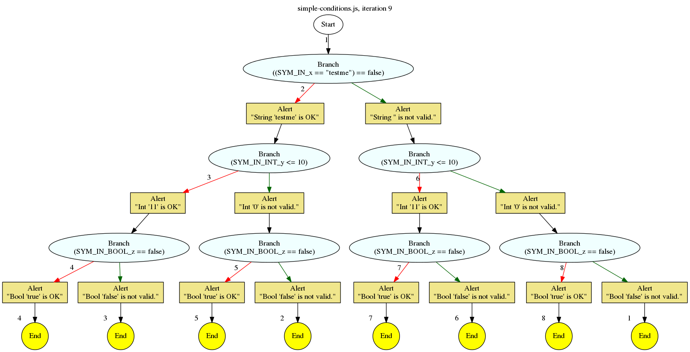

Concolic infrastructure test mode
=================================

This is a new major-mode for Artemis which runs the concolic analysis on standalone JavaScript snippets.
(The normal concolic mode is specifically designed for form validation analysis and relies on this setting.)

Overview
--------

A single JavaScript file is loaded by Artemis and executed.
The context is a blank web page (because of the architecture of Artemis).

There are three new built-in functions which are used to get inputs for the concolic testing:

+------------------------------+--------------------------------------------------------------+
| Function                     | Concolic input                                               |
+==============================+==============================================================+
| ``artemisInputString("x")``  | Returns a string corresponding to concolic variable ``x``.   |
+------------------------------+--------------------------------------------------------------+
| ``artemisInputInteger("y")`` | Returns an integer corresponding to concolic variable ``y``. |
+------------------------------+--------------------------------------------------------------+
| ``artemisInputBoolean("z")`` | Returns a boolean corresponding to concolic variable ``z``.  |
+------------------------------+--------------------------------------------------------------+

These are called by the input JavaScript code to get the inputs for the code being tested.
Any branches depending on these input values should be explored by the concolic analysis, by substituting new values
during a subsequent iteration.

Example
-------

Here is ``simple-conditions.js``:

.. code:: javascript

    var x = artemisInputString('x');
    var y = artemisInputInteger('y');
    var z = artemisInputBoolean('z');
    
    if (x == "testme") {
        alert("String '" + x + "' is OK");
    } else {
        alert("String '" + x + "' is not valid.");
    }
    
    if (y > 10) {
        alert("Int '" + y + "' is OK");
    } else {
        alert("Int '" + y + "' is not valid.");
    }
    
    if (z) {
        alert("Bool '" + z + "' is OK");
    } else {
        alert("Bool '" + z + "' is not valid.");
    }

Artemis is invoked as follows:

.. code:: bash

    artemis --major-mode concolic-test -i 0 --concolic-test-mode-js artemis-code/tests/system/fixtures/concolic-engine/simple-conditions.js -v all

It explores the code in 8 iterations, and produces the following tree:

Tests
-----

There is a test suite for ``concolic-test`` mode, at ``artemis-code/tests/system/concolic_engine.py``.

So far it only tests the mode itself - the symbolic and concolic features are already covered by other test suites.
